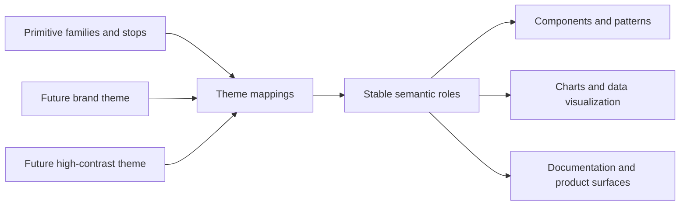
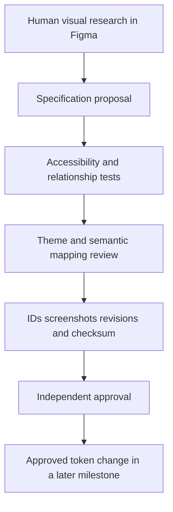
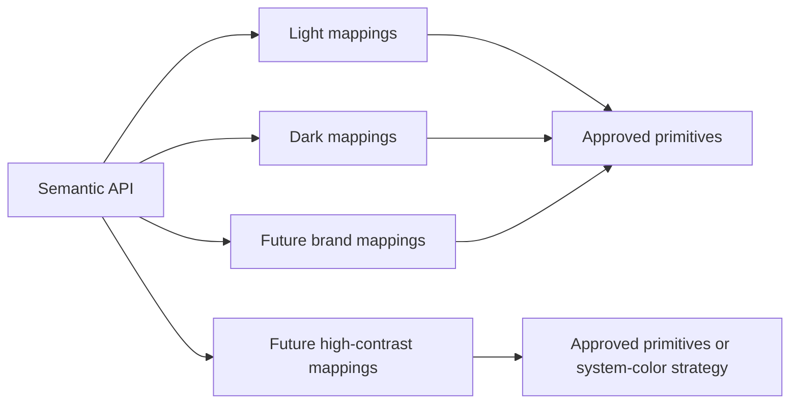

# InterfaceOS Color Foundation Specification

Status: Color Foundation V1 promoted to canonical Git tokens; Figma reconciliation and public release pending

Milestone: IOS-003.2

Evidence ID: `IOS-FND-COLOR`

Owner: Jai Singh (interim Design System Owner)

Machine-readable contract: [`color-foundation.contract.json`](color-foundation.contract.json)
External reference assessment: [`framepad-reference-assessment.md`](framepad-reference-assessment.md)

## Philosophy

InterfaceOS color exists to preserve meaning, hierarchy, operability, and trust across dense enterprise experiences. It is not a decoration layer or a fixed brand palette. Consumers choose stable semantic intent; themes provide reviewed values; primitives remain implementation material rather than a product API.

The canonical Git sources now contain 100 color primitives: 89 approved hue-family stops and 11 categorical data tokens. They also contain 35 semantic aliases and 35 complete Theme mappings in each Light/Dark resolver context. IOS-003.2 derives every promoted value from the frozen IOS-003.1 approval artifact, preserves all 32 previous anchors exactly, and keeps the Figma library private while its 90 missing variable representations await authenticated reconciliation.

## Objectives

- Provide one durable color language for product, documentation, visualization, governance, and future AI consumers.
- Make valid usage easier than raw-value selection.
- Preserve semantic meaning through Light, Dark, future brand, and future high-contrast themes.
- Support dense dashboards, tables, forms, workflows, charts, and long-duration use.
- Make accessibility obligations explicit, testable, and reviewable.
- Allow palette evolution without breaking consumer-facing semantic contracts.
- Keep every visual decision traceable to Figma evidence, Git contracts, reviewers, and revisions.

## Design principles

1. **Meaning before hue:** a role is named by responsibility, never by visual resemblance.
2. **Neutrals carry structure:** broad surfaces, text, borders, and hierarchy remain predominantly neutral.
3. **Chromatic color is scarce signal:** status, action, focus, selection, categorization, and visualization compete for attention and need governed priority.
4. **Relationships are approved:** foreground, background, border, state, and adjacent-surface pairs are reviewed together.
5. **Themes preserve intent:** semantic names and interaction meaning do not change between modes.
6. **States are perceptibly ordered:** rest, hover, active, selected, focus, disabled, and visited states remain distinguishable without relying on hue alone.
7. **Accessibility is a release gate:** automated contrast is necessary but cannot replace color-vision, forced-colors, chart, and manual context testing.
8. **Expansion requires demand:** no family or stop becomes canonical merely to complete a spectrum.
9. **Raw values stay internal:** application and component consumers use semantic tokens except through an approved, documented exception.
10. **No silent drift:** Figma, Git, generated outputs, and evidence reconcile against exact revisions.

## Architecture

## Naming rules

- Primitive: `color.primitive.{family}.{step}`
- Semantic: `color.semantic.{property-or-purpose}.{role}.{state?}`
- Theme slot: `color.theme.{property-or-purpose}.{role}.{state?}`
- Figma: replace canonical dots with `/`; do not rename segments.
- Mode names never appear inside semantic token paths.
- Raw values, platform names, component names, and subjective labels such as `pretty`, `bright`, or `special` are prohibited.
- `primary`, `secondary`, and `accent` are modifiers of a property or purpose, not automatically valid top-level token groups.
- A released rename is breaking and requires deprecation plus migration guidance.

## Primitive color architecture

### Scale strategy

Use perceptually reviewed families with predictable progression, not mathematically even RGB interpolation. Each approved scale must demonstrate capability for subtle surfaces, interactive surfaces, boundaries, solid emphasis, readable foregrounds, and Light/Dark theme mapping. Luminance progression, chroma behavior, hue drift, adjacent-step distinction, and gamut clipping must be documented.

Approved V1 chromatic stops are `50`, `100`, `200`, `300`, `400`, `500`, `600`, `700`, `800`, `900`, and `950`. Neutral also retains the `0` endpoint. These are ordering anchors, not semantic usage guarantees. Data 01–11 uses the separate `color.primitive.data.{01-11}` namespace and is not a hue or lightness scale.

### Candidate families

| Family  | Current disposition  | Intended evaluation                                                           | Prohibited assumption                                  |
| ------- | -------------------- | ----------------------------------------------------------------------------- | ------------------------------------------------------ |
| Neutral | Approved core V1     | Canvas, layered surfaces, text, borders, disabled structure, charts grid/axes | Neutral does not mean low contrast.                    |
| Blue    | Approved core V1     | Product Primary, interaction, focus, and information where mapped             | Primary remains semantic intent, not a duplicate hue.  |
| Green   | Approved core V1     | Success and positive outcomes                                                 | Green alone cannot communicate success.                |
| Red     | Approved core V1     | Danger and error outcomes                                                     | Red does not automatically cover every negative state. |
| Amber   | Approved core V1     | Warning and attention                                                         | Amber is not automatically replaced or renamed.        |
| Indigo  | Approved extended V1 | Advanced, AI, and premium contexts                                            | It is not a core status semantic.                      |
| Purple  | Approved extended V1 | AI, automation, and innovation                                                | It is not a default marketing color.                   |
| Teal    | Approved extended V1 | Analytics, information, and data-heavy contexts                               | Teal must not collide with green success.              |
| Orange  | Not selected for V1  | Future evaluation only                                                        | Do not add it only for spectrum coverage.              |
| Yellow  | Not selected for V1  | Future evaluation only                                                        | Yellow is not presumed readable with light text.       |
| Pink    | Not selected for V1  | Future evaluation only                                                        | Pink is not a default marketing accent.                |

The existing `amber` family is preserved as Warning for V1. Orange, Yellow, and Pink remain outside the approved V1 baseline. IOS-003.2 adds only approved missing stops, Indigo, Purple, Teal, and Data 01–11; it introduces no family beyond the signed IOS-003.1 evidence.

### Stop responsibilities

| Scale region   | Evaluation responsibility                                                       |
| -------------- | ------------------------------------------------------------------------------- |
| Lightest stops | Canvas-adjacent tint, subtle status surface, hover on transparent controls      |
| Light stops    | Muted surfaces, selection fills, low-emphasis data regions                      |
| Middle stops   | Borders, focus candidates, icons, secondary data marks, interactive transitions |
| Strong stops   | Solid action/status backgrounds and high-emphasis data marks                    |
| Dark stops     | Text/icons on light surfaces, strong boundaries, deep status foregrounds        |
| End stops      | Extreme surface/foreground candidates and inverse relationships                 |

No stop receives a universal usage meaning until actual foreground/background pairs are tested. A numeric step is an ordering label, not a semantic guarantee.

### Extended reference comparison inventory

Human Figma exploration must also compare the following external-reference families without adding them to the canonical contract: Slate, Grey, Zinc, Stone, Lime, Emerald, Cyan, Sky, Indigo, Fuchsia, and Rose. Existing or already-proposed InterfaceOS families remain governed by the candidate table above.

`success`, `warning`, and `danger` are not valid primitive family names in InterfaceOS because they encode semantic meaning. Neutral variants and additional chromatic families remain evaluation-only until a documented enterprise, accessibility, chart, identity, or tenant requirement justifies them.

## Semantic color architecture

Semantic roles map stable product intent to theme slots. Theme slots map to primitives. A semantic role may never alias a primitive directly when the meaning must change by theme.

| Category    | Required meaning                                      | Mapping guidance                                                    | Current coverage                          |
| ----------- | ----------------------------------------------------- | ------------------------------------------------------------------- | ----------------------------------------- |
| Primary     | Highest-priority action or emphasis                   | Property-first roles with explicit states and compatible foreground | Partial through interactive primary       |
| Secondary   | Supporting action or emphasis                         | Lower prominence without implying disabled                          | Gap                                       |
| Accent      | Non-status differentiation or user choice             | Swappable hue must not change meaning                               | Gap                                       |
| Success     | Positive completed outcome                            | Background, foreground, border, plus label/icon                     | Current                                   |
| Warning     | Attention before failure                              | Background, foreground, border, plus label/icon                     | Current                                   |
| Error       | Invalid or failed state                               | Separate from destructive action if research supports it            | Decision required; current danger exists  |
| Info        | Neutral explanation or informational state            | Must not be confused with primary action                            | Gap                                       |
| Surface     | Layered or grouped container                          | Ordered layers survive without shadow                               | Partial through background surface/subtle |
| Background  | Page canvas and broad regions                         | Owns application-level environment                                  | Current                                   |
| Border      | Dividers, boundaries, control outlines                | Strong/subtle/state roles require non-text contrast review          | Current                                   |
| Text        | Primary, secondary, muted, inverse, status, link      | Each role declares applicable backgrounds                           | Current/partial                           |
| Interactive | Rest, hover, active, selected, visited where relevant | State order must work in every theme                                | Partial                                   |
| Focus       | Keyboard focus indicator                              | Separate from hover, active, and selection                          | Current ring role                         |
| Selection   | Persistent chosen state                               | Must remain visible when focus moves away                           | Gap                                       |
| Overlay     | Scrim, occlusion, modal separation                    | Validate compositing and forced-colors fallback                     | Gap                                       |
| Disabled    | Unavailable content/control                           | Never communicate state through opacity or color alone              | Partial through disabled text             |
| Inverse     | Opposite-luminance surface/foreground pair            | Approve as explicit pairs                                           | Partial/current                           |
| Muted       | Lower emphasis without loss of required legibility    | Declare contrast obligation and prohibited contexts                 | Partial through secondary/subtle roles    |

### Mapping rules

1. Start with a user-facing meaning and property, not a primitive family.
2. Define the supported states and compatible foreground/background/border relationships.
3. Create one stable semantic role only when at least two consumers or one cross-system requirement justifies it.
4. Map the semantic role to an identically shaped theme slot.
5. Map each supported theme slot to a reviewed primitive alias.
6. Preserve aliases in Git and Figma; never paste resolved values into semantic variables.
7. Record contrast and non-color obligations for every meaningful pair.
8. Reject aliases chosen only because their current rendered values look similar.

### Relationship and emphasis anatomy

The Figma evaluation must cover these reusable responsibilities without assuming each category needs every role:

- surfaces: main, subtle, strong, and inverse counterparts;
- boundaries: default and inverse strokes/borders;
- emphasis: default and strong;
- interaction: default/rest, hover, active, selected, focus, disabled, and visited where applicable;
- text: primary/main, secondary/subtle, muted/subtlest, and inverse counterparts;
- status: surface, foreground, boundary, icon, and optional interaction states only when the status is itself interactive;
- alpha/compositing: translucent and fully transparent endpoints in default and inverse contexts.

Alpha semantics must declare their compositing background, resolved contrast obligation, fallback behavior, and prohibited contexts. Opacity alone is not a color role, and no external percentage is approved by this specification.

## Theme architecture

### Light

- Establishes default enterprise surface hierarchy and readable content relationships.
- Reviews glare, broad white-area dominance, subtle boundaries, and dense table legibility.
- Does not assume the lightest primitive is correct for every canvas.

### Dark

- Is designed independently against the same semantic contract, not produced by reversing the Light scale.
- Reviews low-luminance surface separation, chroma inflation, halation, persistent focus, and long-session comfort.
- Avoids pure-black dependency unless human review proves the use case.

### Future brand themes

- Override only approved theme slots; semantic APIs remain stable.
- Brand decisions cannot weaken status meaning, focus, contrast, or enterprise task hierarchy.
- Each brand theme requires complete mappings, visual evidence, drift checks, and independent review.

### Future high contrast

- Is a distinct authored theme candidate, not merely “more saturated” Light/Dark.
- Targets enhanced text and control differentiation, clearer boundaries, and reduced dependence on subtle surfaces.
- Does not replace operating-system forced-colors support.

## Accessibility model

InterfaceOS targets WCAG 2.2 Level AA for released product use and treats Focus Appearance 2.4.13 as an enhanced AAA design target where feasible. A token cannot conform by itself; conformance attaches to rendered relationships and behavior.

### Required obligations

- Normal text: at least 4.5:1 against every approved background under WCAG 1.4.3.
- Large text: at least 3:1 under the WCAG definition, verified from rendered size and weight rather than token naming.
- Meaningful control boundaries, state indicators, focus indicators, and graphical objects: at least 3:1 against adjacent colors where WCAG 1.4.11 applies.
- Color is never the only visual means of conveying information under WCAG 1.4.1.
- Focus must be visible under WCAG 2.4.7; the enhanced target is a two-CSS-pixel-equivalent indicator area and 3:1 focused/unfocused change under 2.4.13.
- Transparency and overlays are tested after compositing on every permitted background.
- Disabled content retains perceivable labels and structure; exceptions to text contrast are not permission to make state ambiguous.

### Color-vision and ambiguity review

- Review protan, deutan, tritan, achromatopsia/monochrome, and low-contrast simulations as diagnostic tools, not proof of usability.
- Pair status with text, iconography, position, pattern, or shape.
- Test adjacent statuses together, not as isolated swatches.
- Keep destructive, error, warning, queued, informational, selected, and disabled meanings distinct without hue.
- Avoid culturally narrow color assumptions; status copy remains authoritative.

### Forced colors

- Default to allowing user-agent forced-color adjustment.
- Use CSS system colors for meaningful overrides.
- Do not use `forced-color-adjust: none` without component-specific evidence and an accessible replacement strategy.
- Assume shadows and background images may disappear; boundaries, focus, selection, and status must survive.
- Validate Windows High Contrast/forced-colors manually when product UI exists.

### Enterprise dashboards and charts

- Dense tables must distinguish hover, focus, selection, edited, warning, and error states simultaneously.
- Status chips require visible text and/or iconography; a colored dot alone is insufficient.
- Chart series need ordered contrast, CVD collision tests, patterns/markers/direct labels where needed, and text/table alternatives for complex information.
- Gridlines, axes, threshold lines, annotations, selections, and focus must remain perceivable without overpowering data.
- Sequential, diverging, categorical, and status palettes are separate decisions; product status colors are not automatically chart series colors.
- Every chart palette is tested in Light, Dark, high contrast, grayscale, and representative data-density conditions.

## Enterprise requirements

- Versioned primitive, theme, semantic, and validation contracts.
- Complete mode mappings before any theme release.
- Stable semantic API with migration policy for breaking changes.
- Machine-readable ownership, status, evidence, and contrast obligations.
- Figma/Git/source-revision traceability and zero unresolved High/Critical drift.
- Platform-neutral source values with documented gamut and fallback policy.
- Localization, data density, long-session comfort, printing/export, and screenshot/reporting review.
- Brand and tenant customization constrained to approved theme slots.
- Security and operational statuses must never be visually indistinguishable.
- Accessibility and engineering specialist approval remain independent of the design owner.

## Open decisions

1. Approve, revise, or replace the current visual primitive values.
2. Approve the recommended future stop set and decide whether every family needs every stop.
3. Decide whether `amber` remains, expands, or coexists with Orange and Yellow.
4. Decide whether error and destructive danger are distinct semantic concepts.
5. Decide whether Blue remains the primary interaction family.
6. Define Secondary, Accent, Info, Selection, Overlay, and complete Disabled/Muted semantics.
7. Define surface-layer depth and the minimum visible boundary model.
8. Choose sRGB-only versus a future wide-gamut source/fallback strategy.
9. Define chart palette families, ordering, maximum simultaneous series, and non-color encoding.
10. Define tenant/brand theme customization boundaries.
11. Define authored high-contrast theme requirements in addition to forced-colors support.
12. Decide whether a tertiary emphasis tier has a distinct product responsibility or overlaps Secondary, Accent, and Muted.
13. Define whether alpha colors are aliases, composited outputs, or documented recipes and which backgrounds they permit.
14. Choose one neutral temperature direction or justify multiple neutral families.
15. Decide which extended comparison families have demonstrated enterprise, chart, identity, or tenant demand.
16. Assign independent engineering and accessibility specialist reviewers.

## Approval boundary

This specification may be approved as an evaluation framework. It does not approve palette values, add token families, change semantic names, complete Figma boards, establish WCAG conformance, or authorize component work. Those require later evidence-backed decisions.
