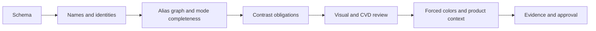

# IOS-003.1 Color Validation Strategy

Status: Automated structural baseline implemented; visual and assistive-technology validation pending

## Validation layers

| Layer                 | Automated now                                                                       | Requires later evidence                                                     |
| --------------------- | ----------------------------------------------------------------------------------- | --------------------------------------------------------------------------- |
| Contract schema       | IOS-003.1 structure, counts, categories, approval state, no visual values           | Human approval of open decisions                                            |
| Primitive integrity   | Naming grammar and duplicate sRGB values                                            | Perceptual progression, gamut, adjacent-step quality                        |
| Semantic completeness | Required semantic paths exist                                                       | Role usefulness, ambiguity, prohibited-use review                           |
| Theme completeness    | Required Light and Dark slots exist                                                 | Dark-mode quality, glare, halation, surface hierarchy                       |
| Alias integrity       | Git reference/cycle checks plus captured Figma Primitive → Theme → Semantic aliases | Cross-platform projections and future drift automation                      |
| Contrast              | Declared opaque sRGB pairs                                                          | Alpha compositing, gradients, images, anti-aliasing, real component context |
| Evidence              | Schema shape, paths, 5 collection IDs, 80 variable IDs, aliases, and screenshots    | Figma revision plus reviewer identity and findings                          |

## Implemented checks

Run `pnpm color:candidates:generate` to reproduce the provisional palette and `pnpm color:candidates:check` to detect drift. Candidate tests verify canonical hashes, exact anchor preservation, family counts and order, monotonic OKLCH lightness, duplicate HEX values, Primary-to-Blue equality, categorical Data labels, and the non-canonical approval boundary.

Gamut mapping, contrast, adjacent-step, and approximate color-vision diagnostics are frozen per approved swatch in [`color-candidates.approved-v1.json`](color-candidates.approved-v1.json). The current reproducible diagnostic projection remains [`color-candidates.generated.json`](color-candidates.generated.json). Automated passes are evidence for review, never accessibility approval.

`packages/tokens/lib/color-foundation-validator.mjs` and the token validation pipeline now reject:

- missing required semantic color mappings;
- duplicate primitive sRGB values unless an explicit reviewed exception is supplied;
- missing required Light or Dark theme mappings;
- failed declared contrast obligations;
- invalid primitive, semantic, or theme color naming.

These checks run against current canonical sources without changing them. Tests include failing fixtures for every required category.

## Future validation inputs

A human-approved visual proposal must supply:

- candidate source file or review export with stable identity;
- complete family and stop inventory;
- semantic/theme mapping proposal;
- contrast obligation matrix including alpha-composited pairs;
- explicit duplicate-value exceptions with rationale;
- supported gamut and fallback data;
- CVD/grayscale collision matrix;
- chart-series ordering and collision results;
- Figma/Git revisions and synchronization checksum;
- specialist reviewer evidence.

## Duplicate-color policy

Exact duplicate primitive values are rejected because they create multiple identities for one decision. A legitimate shared endpoint or compatibility alias requires an explicit exception listing every affected path, rationale, owner, review date, and removal/migration policy. Near-duplicates require human perceptual review; a numeric threshold must not be invented without evidence.

## Contrast policy

- Store obligations as named foreground/background pairs with minimum ratio and WCAG reference.
- Resolve aliases per theme before calculation.
- Compute opaque sRGB relative luminance for deterministic baseline evidence.
- Composite alpha before calculation; never test the uncomposited foreground alone.
- Test every permitted background, including hover, selected, overlay, and status contexts.
- Treat automated pass as relationship evidence, not a conformance claim.
- Add APCA only as supplementary research if governance approves it; WCAG 2.2 remains the release contract unless formally changed.

## CI evolution

1. Current: validate canonical Git names, aliases, mappings, duplicate values, declared ratios, schemas, generated projections, and provisional candidate drift.
2. After visual approval: validate a versioned color-foundation decision record against the exact approved token proposal.
3. Current Figma execution: compare the captured 5 collections, 80 color variables, 48 Theme aliases, 24 Semantic aliases, modes, names, and checksums against canonical Git sources.
4. After UI implementation: run browser contrast, forced-colors, visual regression, chart, and manual assistive-technology protocols.
5. Before public release: require a named accessibility specialist audit, engineering review of the canonical promotion diff, independent release approval, and no unresolved Critical/High drift. These release gates are separate from the approved V1 visual-foundation decision.

## Failure severity

| Severity | Examples                                                                                 | Effect                                                        |
| -------- | ---------------------------------------------------------------------------------------- | ------------------------------------------------------------- |
| Critical | Meaning lost in forced colors; status distinguishable only by color; fabricated evidence | Blocks approval and release                                   |
| High     | Missing theme mapping, broken alias, failed required contrast, wrong canonical value     | Blocks affected foundation and consumers                      |
| Medium   | Wrong description, scope, state rationale, or incomplete CVD/chart evidence              | Blocks foundation approval unless time-bound exception exists |
| Low      | Stale screenshot crop with otherwise independently verifiable evidence                   | Requires correction according to governance priority          |

## Honest limitation

No automated check can approve visual harmony, long-session comfort, semantic comprehension, cultural interpretation, state ambiguity, forced-colors usability, or chart readability. Those remain manual research and specialist-review obligations.
